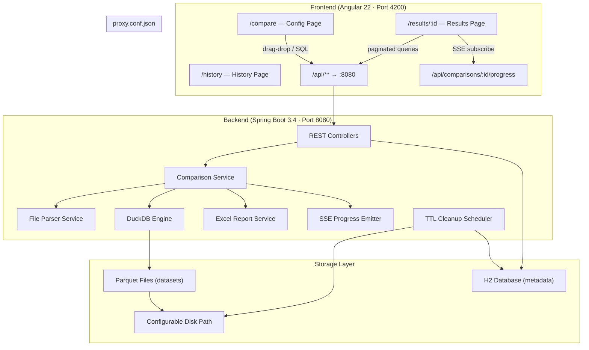
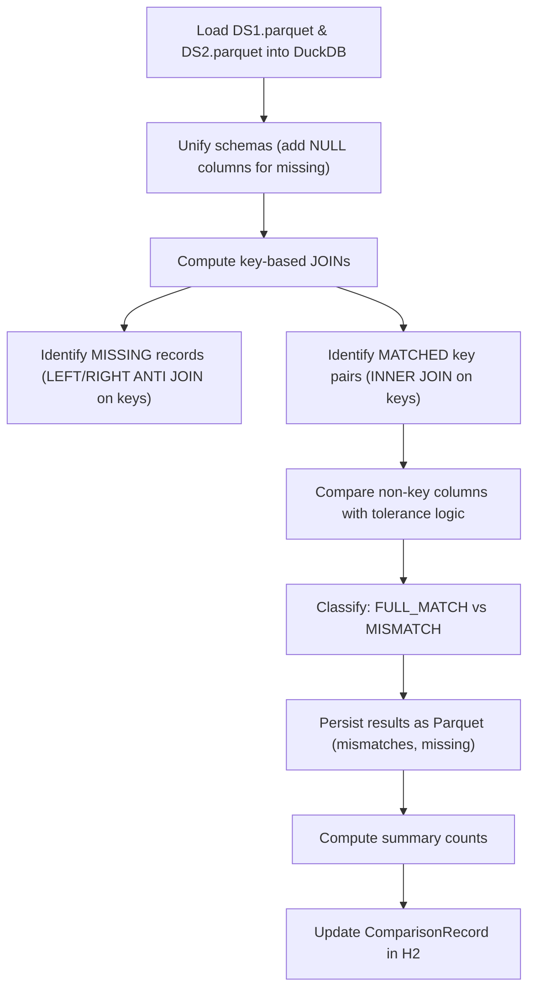

# Implementation Plan — Data Comparator

## Goal

Build a full-stack web application that compares two datasets (uploaded files or SQL query results) and displays detailed match/mismatch/missing analysis. Angular 22 frontend, Spring Boot Java 21 backend, DuckDB for Parquet-based comparison.

> [!NOTE]
> This plan references all 36 settled design decisions from [design-decisions.md](file:///C:/Users/Admin/.gemini/antigravity-cli/brain/d1560127-54d6-474e-bd86-606e591dd49d/design-decisions.md).

---

## Architecture Overview



## Environment

| Tool | Version |
|------|---------|
| Java | 26.0.2 (targeting 21 compilation) |
| Maven | 3.8.4 |
| Node.js | 26.7.0 |
| npm | 12.0.2 |
| Angular CLI | 22.1.5 |

---

## Proposed Changes

### Phase 1: Project Scaffolding

Scaffold both projects within the monorepo.

---

#### [NEW] `backend/pom.xml`

Spring Boot 3.4.13 Maven project with all dependencies:

```xml
<?xml version="1.0" encoding="UTF-8"?>
<project xmlns="http://maven.apache.org/POM/4.0.0"
         xmlns:xsi="http://www.w3.org/2001/XMLSchema-instance"
         xsi:schemaLocation="http://maven.apache.org/POM/4.0.0
         https://maven.apache.org/xsd/maven-4.0.0.xsd">
    <modelVersion>4.0.0</modelVersion>

    <parent>
        <groupId>org.springframework.boot</groupId>
        <artifactId>spring-boot-starter-parent</artifactId>
        <version>3.4.13</version>
        <relativePath/>
    </parent>

    <groupId>com.comparator</groupId>
    <artifactId>data-comparator-backend</artifactId>
    <version>0.0.1-SNAPSHOT</version>
    <name>data-comparator-backend</name>

    <properties>
        <java.version>21</java.version>
    </properties>

    <dependencies>
        <!-- Web + SSE -->
        <dependency>
            <groupId>org.springframework.boot</groupId>
            <artifactId>spring-boot-starter-web</artifactId>
        </dependency>

        <!-- JPA + H2 (metadata) -->
        <dependency>
            <groupId>org.springframework.boot</groupId>
            <artifactId>spring-boot-starter-data-jpa</artifactId>
        </dependency>
        <dependency>
            <groupId>com.h2database</groupId>
            <artifactId>h2</artifactId>
            <scope>runtime</scope>
        </dependency>

        <!-- DuckDB (Parquet R/W + comparison) -->
        <dependency>
            <groupId>org.duckdb</groupId>
            <artifactId>duckdb_jdbc</artifactId>
            <version>1.5.5.1</version>
        </dependency>

        <!-- PostgreSQL JDBC (SQL dataset input) -->
        <dependency>
            <groupId>org.postgresql</groupId>
            <artifactId>postgresql</artifactId>
            <scope>runtime</scope>
        </dependency>

        <!-- Excel export -->
        <dependency>
            <groupId>org.apache.poi</groupId>
            <artifactId>poi-ooxml</artifactId>
            <version>5.5.1</version>
        </dependency>

        <!-- Excel parsing (.xls/.xlsx uploads) -->
        <dependency>
            <groupId>org.apache.poi</groupId>
            <artifactId>poi</artifactId>
            <version>5.5.1</version>
        </dependency>

        <!-- Validation -->
        <dependency>
            <groupId>org.springframework.boot</groupId>
            <artifactId>spring-boot-starter-validation</artifactId>
        </dependency>

        <!-- Test -->
        <dependency>
            <groupId>org.springframework.boot</groupId>
            <artifactId>spring-boot-starter-test</artifactId>
            <scope>test</scope>
        </dependency>
    </dependencies>

    <build>
        <plugins>
            <plugin>
                <groupId>org.springframework.boot</groupId>
                <artifactId>spring-boot-maven-plugin</artifactId>
            </plugin>
        </plugins>
    </build>
</project>
```

#### [NEW] `backend/src/main/resources/application.yml`

```yaml
server:
  port: 8080

spring:
  datasource:
    url: jdbc:h2:file:./data/comparator-db
    driver-class-name: org.h2.Driver
    username: sa
    password:
  jpa:
    hibernate:
      ddl-auto: update
    show-sql: false
  servlet:
    multipart:
      max-file-size: 500MB
      max-request-size: 500MB

app:
  storage:
    path: C:\Users\Admin\Documents\node-projects\helloworld-data-comparator\data
  upload:
    max-file-size: 500MB
  cleanup:
    ttl-hours: 1
  comparison:
    timeout-minutes: 30
```

#### [NEW] `frontend/` — Angular 22 project

Generated via:
```bash
ng new data-comparator-frontend --routing --ssr=false --style=scss --directory=frontend
```

Then install dependencies:
```bash
cd frontend
ng add @angular/material
npm install chart.js ng2-charts
npm install codemirror @codemirror/lang-sql @codemirror/state @codemirror/view
```

#### [NEW] `frontend/proxy.conf.json`

```json
{
  "/api": {
    "target": "http://localhost:8080",
    "secure": false,
    "changeOrigin": true
  }
}
```

---

### Phase 2: Backend — Domain Model & Configuration

---

#### [NEW] Backend package structure

```
com.comparator
├── DataComparatorApplication.java          # @SpringBootApplication
├── config/
│   ├── AppProperties.java                  # @ConfigurationProperties("app")
│   └── WebConfig.java                      # CORS config for dev
├── model/
│   ├── entity/
│   │   └── ComparisonRecord.java           # JPA entity → H2
│   ├── enums/
│   │   ├── ComparisonStatus.java           # PENDING, UPLOADING, CONVERTING, COMPARING, COMPLETED, FAILED
│   │   └── DataSourceType.java             # FILE_UPLOAD, SQL_QUERY
│   └── dto/
│       ├── ComparisonRequest.java           # Config from frontend
│       ├── ComparisonSummary.java           # Summary stats
│       ├── MismatchDetail.java              # Single mismatch row pair
│       ├── MissingDetail.java               # Single missing row
│       ├── ColumnHeader.java                # Auto-detected column name
│       ├── ToleranceConfig.java             # Column name + percentage
│       ├── DatabaseConnectionConfig.java    # PG connection details
│       └── PagedResult.java                 # Generic paginated response
├── repository/
│   └── ComparisonRepository.java            # Spring Data JPA
├── service/
│   ├── ComparisonService.java               # Orchestrates the full workflow
│   ├── FileParserService.java               # Parse CSV/TXT/XLS/XLSX → Parquet
│   ├── DelimiterDetector.java               # Auto-detect delimiter
│   ├── DuckDbService.java                   # DuckDB operations
│   ├── SqlDataSourceService.java            # Execute SELECT on PostgreSQL
│   ├── ComparisonEngine.java                # Core comparison logic via DuckDB SQL
│   ├── ExcelReportService.java              # POI SXSSF report generation
│   ├── ProgressService.java                 # SSE emitter management
│   └── CleanupService.java                  # @Scheduled TTL cleanup
└── controller/
    ├── ComparisonController.java             # REST endpoints
    └── ReportController.java                 # Excel download endpoint
```

#### [NEW] `ComparisonRecord.java` — JPA Entity

```java
@Entity
@Table(name = "comparisons")
public class ComparisonRecord {
    @Id
    private String id;                        // UUID
    
    @Enumerated(EnumType.STRING)
    private ComparisonStatus status;
    
    private LocalDateTime createdAt;
    private LocalDateTime completedAt;
    
    // Dataset 1 metadata
    @Enumerated(EnumType.STRING)
    private DataSourceType ds1Type;
    private String ds1FileName;
    
    // Dataset 2 metadata
    @Enumerated(EnumType.STRING)
    private DataSourceType ds2Type;
    private String ds2FileName;
    
    // Configuration (stored as JSON string)
    @Column(length = 4000)
    private String configJson;
    
    // Summary results
    private Long ds1RecordCount;
    private Long ds2RecordCount;
    private Long ds1FullyMatching;
    private Long ds2FullyMatching;
    private Long ds1NotMatching;
    private Long ds2NotMatching;
    private Long ds1MissingInDs2;
    private Long ds2MissingInDs1;
    
    private String errorMessage;
}
```

#### [NEW] `AppProperties.java` — Configuration Properties

```java
@ConfigurationProperties(prefix = "app")
public record AppProperties(
    StorageProperties storage,
    UploadProperties upload,
    CleanupProperties cleanup,
    ComparisonProperties comparison
) {
    public record StorageProperties(String path) {}
    public record UploadProperties(String maxFileSize) {}
    public record CleanupProperties(int ttlHours) {}
    public record ComparisonProperties(int timeoutMinutes) {}
}
```

---

### Phase 3: Backend — File Upload, Parsing & Parquet Conversion

---

#### [NEW] `FileParserService.java`

Handles all input file formats → DuckDB-managed Parquet:

```
Input File → FileParserService → DuckDB COPY → Parquet on Disk
```

**Key logic:**

| Format | Strategy |
|--------|----------|
| `.csv` / `.txt` | DuckDB `read_csv_auto()` or `read_csv()` with detected/custom delimiter → `COPY ... TO ... (FORMAT PARQUET)` |
| `.xls` | Apache POI `HSSFWorkbook` → stream rows into DuckDB temp table → export to Parquet |
| `.xlsx` | Apache POI `XSSFWorkbook` (streaming `SXSSFWorkbook` can't read, use event-model `XSSFReader` for large files) → DuckDB → Parquet |

#### [NEW] `DelimiterDetector.java`

```java
public class DelimiterDetector {
    private static final char[] CANDIDATES = {',', '\t', '|', ';'};
    
    /**
     * Read first N lines (e.g., 10), count occurrences of each candidate.
     * Pick the delimiter with the most consistent count across lines.
     * If no confident match, default to comma.
     */
    public char detect(InputStream sample) { ... }
}
```

**Algorithm:**
1. Read first 10 lines of the file
2. For each candidate delimiter, count occurrences per line
3. A delimiter is "consistent" if its count per line has zero variance (same count each line) and count > 0
4. Pick the consistent delimiter with the highest count
5. If no candidate is consistent, default to `,`

#### [NEW] `SqlDataSourceService.java`

```java
public class SqlDataSourceService {
    /**
     * 1. Validate SQL is a SELECT statement
     * 2. Connect to user-provided PostgreSQL
     * 3. Execute query with streaming ResultSet
     * 4. Write results to Parquet via DuckDB
     */
    public Path executeAndConvert(DatabaseConnectionConfig config, 
                                   String sql, 
                                   Path outputPath) { ... }
}
```

**Security:** Validate that the SQL starts with `SELECT` (after trimming/normalizing). Reject `INSERT`, `UPDATE`, `DELETE`, `DROP`, `CREATE`, `ALTER`, etc.

#### [NEW] `DuckDbService.java`

Low-level DuckDB operations:

```java
public class DuckDbService {
    /** Create an in-memory DuckDB connection for a comparison */
    public Connection createConnection();
    
    /** Convert CSV/TXT to Parquet */
    public void csvToParquet(Path csvPath, Path parquetPath, char delimiter);
    
    /** Write ResultSet rows to Parquet via temp table */
    public void resultSetToParquet(ResultSet rs, Path parquetPath);
    
    /** Read Parquet column headers */
    public List<String> getColumnHeaders(Path parquetPath);
    
    /** Execute paginated query on Parquet */
    public List<Map<String, Object>> query(Path parquetPath, String sql, int offset, int limit);
}
```

---

### Phase 4: Backend — Comparison Engine

The core algorithm, implemented entirely as DuckDB SQL queries over Parquet files.

---

#### [NEW] `ComparisonEngine.java`



**DuckDB SQL strategy for comparison:**

```sql
-- 1. Schema unification: create views with aligned columns
CREATE VIEW ds1 AS SELECT *, NULL AS extra_col_from_ds2 FROM read_parquet('ds1.parquet');
CREATE VIEW ds2 AS SELECT *, NULL AS extra_col_from_ds1 FROM read_parquet('ds2.parquet');

-- 2. Missing from DS2 (keys in DS1 not in DS2)
CREATE TABLE missing_from_ds2 AS
SELECT ds1.* FROM ds1 
ANTI JOIN ds2 ON ds1.key1 = ds2.key1 AND ds1.key2 = ds2.key2;

-- 3. Missing from DS1 (keys in DS2 not in DS1)
CREATE TABLE missing_from_ds1 AS
SELECT ds2.* FROM ds2 
ANTI JOIN ds1 ON ds2.key1 = ds1.key1 AND ds2.key2 = ds1.key2;

-- 4. Key-matched pairs (INNER JOIN)
CREATE TABLE matched_pairs AS
SELECT ds1.*, ds2.*
FROM ds1 INNER JOIN ds2 ON ds1.key1 = ds2.key1 AND ds1.key2 = ds2.key2;

-- 5. From matched_pairs, classify FULL_MATCH vs MISMATCH
--    For tolerance columns: ABS(ds1.col - ds2.col) <= (tolerance_pct/100) * GREATEST(ABS(ds1.col), ABS(ds2.col))
--    For case-insensitive: LOWER(ds1.col) = LOWER(ds2.col)
--    For regular columns: ds1.col = ds2.col OR (ds1.col IS NULL AND ds2.col IS NULL)
```

**One-to-many handling:** The INNER JOIN naturally handles duplicates — if DS1 has 1 record with `key=1` and DS2 has 2 records with `key=1`, the JOIN produces 2 pairs. Each pair is evaluated independently.

**Tolerance logic (per Example 3):**
```sql
-- For a tolerance column 'score' with 1% tolerance:
-- Match if: actual_ds1 falls within ds2 ± tolerance OR actual_ds2 falls within ds1 ± tolerance
(ABS(ds1.score - ds2.score) <= (0.01 * ABS(ds1.score)))
OR 
(ABS(ds1.score - ds2.score) <= (0.01 * ABS(ds2.score)))
```

**Result storage:** Mismatches and missing records are written back to Parquet files in the comparison directory for efficient paginated retrieval:

```
data/
└── {comparison-id}/
    ├── ds1.parquet              # Original dataset 1
    ├── ds2.parquet              # Original dataset 2
    ├── mismatches_ds1.parquet   # DS1 side of mismatched pairs
    ├── mismatches_ds2.parquet   # DS2 side of mismatched pairs
    ├── missing_from_ds1.parquet # Records in DS2 missing from DS1
    └── missing_from_ds2.parquet # Records in DS1 missing from DS2
```

---

### Phase 5: Backend — REST API, SSE Progress & Excel Export

---

#### [NEW] `ComparisonController.java` — REST API

| Method | Path | Description |
|--------|------|-------------|
| `POST` | `/api/comparisons` | Create comparison (multipart: files + config JSON) |
| `GET` | `/api/comparisons` | List all comparisons (history) |
| `GET` | `/api/comparisons/{id}` | Get comparison summary & status |
| `GET` | `/api/comparisons/{id}/progress` | SSE stream for progress updates |
| `GET` | `/api/comparisons/{id}/headers` | Get auto-detected column headers |
| `GET` | `/api/comparisons/{id}/mismatches` | Paginated mismatched record pairs (`?page=0&size=50&direction=ds1`) |
| `GET` | `/api/comparisons/{id}/missing` | Paginated missing records (`?page=0&size=50&direction=ds1`) |
| `GET` | `/api/comparisons/{id}/matches` | Paginated fully matching records |
| `GET` | `/api/comparisons/{id}/report` | Download Excel report |
| `DELETE` | `/api/comparisons/{id}` | Delete a comparison and its files |

**Two-step workflow for the POST endpoint:**

> [!IMPORTANT]
> The comparison workflow is split into two API calls to support the column auto-detection UX (Q10):
> 1. **`POST /api/comparisons/upload`** — Upload files (or submit SQL config). Returns `comparisonId` + auto-detected column headers. Status = `UPLOADED`.
> 2. **`POST /api/comparisons/{id}/execute`** — Submit key columns, tolerance config, case sensitivity toggle. Kicks off async comparison. Status transitions: `CONVERTING → COMPARING → COMPLETED/FAILED`.

This separation allows the frontend to show auto-detected columns for user selection before starting the comparison.

#### [NEW] `ProgressService.java` — SSE

```java
@Service
public class ProgressService {
    private final Map<String, List<SseEmitter>> emitters = new ConcurrentHashMap<>();

    public SseEmitter subscribe(String comparisonId) {
        SseEmitter emitter = new SseEmitter(1800000L); // 30 min timeout
        emitters.computeIfAbsent(comparisonId, k -> new CopyOnWriteArrayList<>()).add(emitter);
        emitter.onCompletion(() -> removeEmitter(comparisonId, emitter));
        emitter.onTimeout(() -> removeEmitter(comparisonId, emitter));
        return emitter;
    }

    public void emit(String comparisonId, String stage, int percentComplete) {
        // Send SSE event: { "stage": "COMPARING", "percent": 75 }
    }
}
```

**SSE event stages:**
```
UPLOADING → CONVERTING → COMPARING → COMPLETED
                                   → FAILED (with error message)
```

#### [NEW] `ExcelReportService.java`

Generates `.xlsx` using Apache POI SXSSF:

| Sheet | Content |
|-------|---------|
| **Summary** | All summary counts, comparison config, timestamp |
| **Mismatches (DS1→DS2)** | DS1 records with their DS2 counterpart, differing cells highlighted in orange |
| **Mismatches (DS2→DS1)** | DS2 records with their DS1 counterpart (if directionally different) |
| **Missing from DS2** | Records present in DS1 but missing from DS2 |
| **Missing from DS1** | Records present in DS2 but missing from DS1 |

- If any detail sheet exceeds 1,048,576 rows → split into "Mismatches (DS1→DS2) (1)", "(2)", etc.
- Differing cells styled with orange/red fill using `CellStyle` + `FillPatternType.SOLID_FOREGROUND`
- Header row frozen (`createFreezePane`), bold, with auto-filter

---

### Phase 6: Frontend — Configuration Page (`/compare`)

---

#### [NEW] Angular components and services

```
src/app/
├── app.component.ts                    # Shell with toolbar
├── app.config.ts                       # provideRouter, provideHttpClient, provideCharts
├── app.routes.ts                       # Route definitions
├── services/
│   ├── comparison.service.ts           # HTTP client for all API calls
│   └── progress.service.ts             # EventSource wrapper for SSE
├── pages/
│   ├── history/
│   │   └── history.component.ts        # List comparisons, link to results
│   ├── compare/
│   │   ├── compare.component.ts        # Main config page orchestrator
│   │   ├── dataset-input/
│   │   │   └── dataset-input.component.ts  # Reusable: file upload OR SQL input
│   │   ├── file-dropzone/
│   │   │   └── file-dropzone.component.ts  # Drag-drop + file picker
│   │   ├── sql-editor/
│   │   │   └── sql-editor.component.ts     # CodeMirror 6 wrapper
│   │   ├── column-selector/
│   │   │   └── column-selector.component.ts # Multi-select + manual input
│   │   └── tolerance-config/
│   │       └── tolerance-config.component.ts # Column + percentage pairs
│   └── results/
│       ├── results.component.ts        # Main results page
│       ├── summary-cards/
│       │   └── summary-cards.component.ts   # Metric cards
│       ├── summary-chart/
│       │   └── summary-chart.component.ts   # Chart.js bar/donut
│       └── detail-table/
│           └── detail-table.component.ts    # Side-by-side paginated table
└── models/
    ├── comparison.model.ts             # TypeScript interfaces
    └── api-response.model.ts           # API response types
```

#### Compare page layout

```
┌──────────────────────────────────────────────────────────┐
│  Data Comparator                              [History]  │
├──────────────────────────────────────────────────────────┤
│                                                          │
│  ┌─────────────────────┐  ┌─────────────────────┐       │
│  │   Dataset 1          │  │   Dataset 2          │       │
│  │                      │  │                      │       │
│  │  ○ Upload File       │  │  ○ Upload File       │       │
│  │  ○ SQL Query         │  │  ○ SQL Query         │       │
│  │                      │  │                      │       │
│  │  ┌──────────────┐   │  │  ┌──────────────┐   │       │
│  │  │ Drop file or │   │  │  │ Drop file or │   │       │
│  │  │ click to     │   │  │  │ click to     │   │       │
│  │  │ browse       │   │  │  │ browse       │   │       │
│  │  └──────────────┘   │  │  └──────────────┘   │       │
│  │                      │  │                      │       │
│  │  Delimiter: [auto ▾] │  │  Delimiter: [auto ▾] │       │
│  └─────────────────────┘  └─────────────────────┘       │
│                                                          │
│  ─── Comparison Settings ───────────────────────         │
│                                                          │
│  Key Columns:  [chip] [chip] [+ Add]                    │
│                                                          │
│  Tolerance Columns:                                      │
│  ┌──────────────┬──────────┐                            │
│  │ Column Name  │ % Tol.   │  [+ Add] [× Remove]       │
│  └──────────────┴──────────┘                            │
│                                                          │
│  ☐ Case-insensitive comparison                          │
│                                                          │
│  [ Upload & Compare ]                                    │
│                                                          │
└──────────────────────────────────────────────────────────┘
```

**Key interactions:**
1. User selects file or SQL mode for each dataset via `mat-radio-group`
2. File mode: `file-dropzone` component with drag-drop and `<input type="file" accept=".csv,.txt,.xls,.xlsx">`
3. SQL mode: `sql-editor` component (CodeMirror 6) + `mat-expansion-panel` for DB connection fields
4. Delimiter: `mat-select` with options: Auto-detect, Comma, Tab, Pipe, Semicolon, Custom (reveals text input)
5. On "Upload & Compare" click:
   - Call `POST /api/comparisons/upload` with files/SQL config
   - Receive `comparisonId` + auto-detected column headers
   - Populate key column selector with detected headers
   - User selects key columns and tolerances
   - Call `POST /api/comparisons/{id}/execute`
   - Navigate to `/results/{id}`

> [!IMPORTANT]
> The upload-then-configure flow means the "Upload & Compare" button actually triggers a two-step process. After upload, a dialog or expandable section reveals the column selectors populated with auto-detected headers. A second "Start Comparison" button triggers execution.

**Revised flow:**
1. **Step 1 — "Upload"** button: uploads files / submits SQL → returns headers
2. Column selectors appear, pre-populated with detected headers
3. **Step 2 — "Compare"** button: submits key columns + tolerance config → starts comparison
4. Auto-navigates to `/results/:id`

---

### Phase 7: Frontend — Results Dashboard (`/results/:id`)

---

#### Results page layout

```
┌──────────────────────────────────────────────────────────┐
│  ← Back to Compare    Comparison #abc123     [Download]  │
├──────────────────────────────────────────────────────────┤
│                                                          │
│  ┌──────────┐ ┌──────────┐ ┌──────────┐ ┌──────────┐   │
│  │ DS1 Rows │ │ DS2 Rows │ │ Matching │ │ Mismatch │   │
│  │  10,000  │ │  10,234  │ │  9,800   │ │   200    │   │
│  └──────────┘ └──────────┘ └──────────┘ └──────────┘   │
│  ┌──────────┐ ┌──────────┐                              │
│  │ Missing  │ │ Missing  │      ┌──────────────────┐   │
│  │ from DS2 │ │ from DS1 │      │  [Bar Chart]     │   │
│  │    50    │ │    84    │      │                   │   │
│  └──────────┘ └──────────┘      └──────────────────┘   │
│                                                          │
│  ─── Detail View ───────────────────────────────         │
│                                                          │
│  [Mismatches] [Missing from DS2] [Missing from DS1]     │
│                                                          │
│  ┌─────────────────────────┬─────────────────────────┐  │
│  │ Dataset 1               │ Dataset 2               │  │
│  ├─────┬───────┬───────────┼─────┬───────┬───────────┤  │
│  │ id  │ name  │ score     │ id  │ name  │ score     │  │
│  │ 1   │ Alice │ [95]      │ 1   │ Alice │ [96]      │  │
│  │ 2   │ Bob   │ 88        │ 2   │ Bob   │ 88        │  │
│  ├─────┴───────┴───────────┼─────┴───────┴───────────┤  │
│  │         « 1 2 3 ... »   │                         │  │
│  └─────────────────────────┴─────────────────────────┘  │
│                                                          │
└──────────────────────────────────────────────────────────┘
```

- `[95]` / `[96]` cells highlighted in orange/red for mismatches
- `mat-tab-group` to switch between Mismatches, Missing from DS2, Missing from DS1
- `mat-paginator` for server-side pagination (page size: 50)
- "Download" button calls `GET /api/comparisons/{id}/report` → streams `.xlsx`
- SSE subscription on page load shows progress bar (`mat-progress-bar`) until `COMPLETED`

---

### Phase 8: Frontend — History Page (`/` or `/history`)

---

#### History page layout

Simple `mat-table` with columns:

| Column | Content |
|--------|---------|
| ID | Short UUID (clickable → `/results/:id`) |
| Created | Formatted timestamp |
| Status | Chip: `COMPLETED` (green), `COMPARING` (blue), `FAILED` (red) |
| DS1 Source | File name or "SQL Query" |
| DS2 Source | File name or "SQL Query" |
| Records | DS1 count / DS2 count |
| Actions | View Results, Delete |

- Auto-refreshes via polling every 30s (simple `interval` observable)
- "New Comparison" button navigates to `/compare`

---

### Phase 9: Backend — Scheduled Cleanup

---

#### [NEW] `CleanupService.java`

```java
@Service
public class CleanupService {
    @Scheduled(fixedRate = 900000) // Every 15 minutes
    public void cleanup() {
        LocalDateTime cutoff = LocalDateTime.now().minusHours(appProperties.cleanup().ttlHours());
        List<ComparisonRecord> expired = repository.findByCreatedAtBefore(cutoff);
        for (ComparisonRecord record : expired) {
            // Delete Parquet files from disk
            FileUtils.deleteDirectory(Path.of(storagePath, record.getId()));
            // Delete H2 record
            repository.delete(record);
        }
    }
}
```

---

## Execution Order

```mermaid
gantt
    title Implementation Phases
    dateFormat X
    axisFormat %s

    section Scaffolding
    Phase 1 - Project Setup           :p1, 0, 1

    section Backend
    Phase 2 - Domain Model & Config   :p2, after p1, 1
    Phase 3 - File Upload & Parsing   :p3, after p2, 2
    Phase 4 - Comparison Engine       :p4, after p3, 2
    Phase 5 - API, SSE & Excel        :p5, after p4, 2

    section Frontend
    Phase 6 - Config Page             :p6, after p5, 2
    Phase 7 - Results Dashboard       :p7, after p6, 2
    Phase 8 - History Page            :p8, after p7, 1

    section Ops
    Phase 9 - Cleanup Scheduler       :p9, after p2, 1
```



> [!NOTE]
> Phases will be executed sequentially. Each phase will be verified before moving to the next.

---

## User Review Required

> [!IMPORTANT]
> **Two-step upload flow (Phase 6):** The original requirement describes a single "Upload & Compare" action, but auto-detecting column headers (Q10) requires uploading first, then configuring keys. The plan splits this into Upload → Configure Columns → Execute. Please confirm this UX flow is acceptable.

> [!WARNING]
> **Java version mismatch:** Your system has Java 26, but the requirement specifies Java 21. The `pom.xml` sets `<java.version>21</java.version>` for compilation target. This should work fine with Java 26 (backward compatible), but Spring Boot 3.4.x is tested against Java 17–21. If any runtime issues arise, we can upgrade to Spring Boot 4.x which targets Java 26.

---

## Verification Plan

### Automated Tests

After each phase, run:

```bash
# Backend
cmd /c "cd backend && mvn clean compile"          # Phase 1-2: compiles
cmd /c "cd backend && mvn test"                    # Phase 3-5: unit tests

# Frontend
cmd /c "cd frontend && npm run build"              # Phase 6-8: compiles
cmd /c "cd frontend && npm test -- --watch=false"  # Phase 6-8: unit tests
```

### Manual Verification

After all phases:

1. **Start backend:** `cmd /c "cd backend && mvn spring-boot:run"`
2. **Start frontend:** `cmd /c "cd frontend && ng serve --proxy-config proxy.conf.json"`
3. **Upload test:** Upload two small CSV files, verify Parquet files appear in `data/` directory
4. **Comparison test:** Configure key columns, run comparison, verify summary counts
5. **Tolerance test:** Add a tolerance column, verify near-matches are counted as matches
6. **Pagination test:** Upload larger files (1000+ rows), verify paginated results
7. **Excel test:** Download report, verify summary sheet + detail sheets with highlighted mismatches
8. **History test:** Navigate to history page, verify comparisons are listed
9. **Cleanup test:** Set TTL to 1 minute, wait, verify old files are deleted
10. **SQL test:** Configure PostgreSQL connection, run a SELECT query, verify dataset loads
